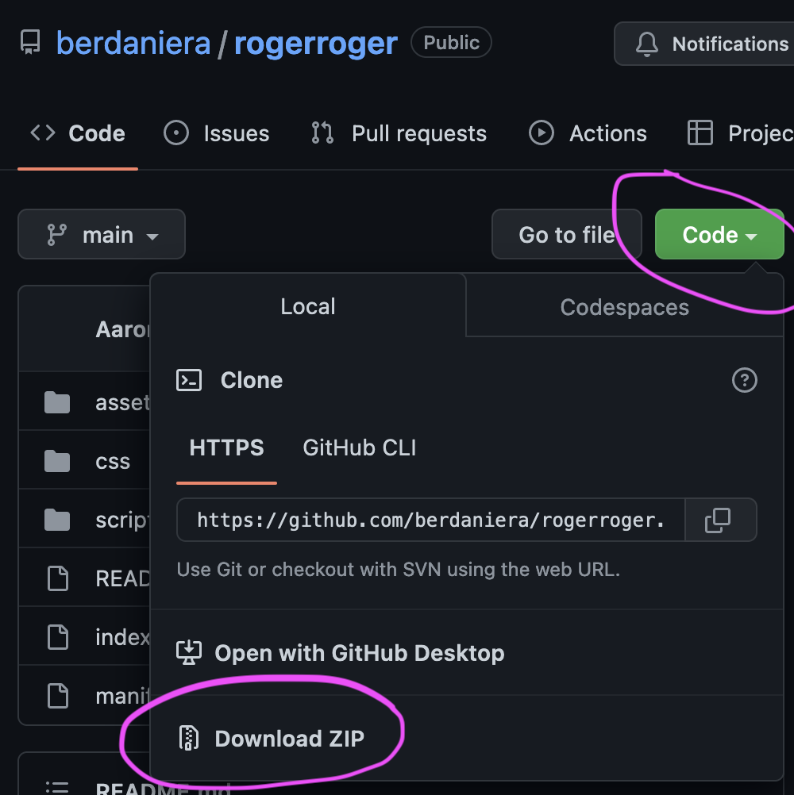

# Roger Roger

This is code for our private beta of Roger Roger. It is built for Chrome or other Chromium browsers (e.g., Brave).

## Installation

1. Download Zip: Click the green `<> Code` button in the upper right, and then click `Download ZIP`.
    - 
2. Unzip locally: Save and unzip the folder somewhere.
3. Install extension: Follow the directions here: https://developer.chrome.com/docs/extensions/mv3/getstarted/development-basics/#load-unpacked
4. Open extension: Click the `Extension` icon on the toolbar to open.
    - 

## Usage

1. Enter your API key that we sent you. This gives you access to the application.
2. Select some text in the browser that you want to interpret.
3. Open the browser extension again. Wait for the interpretation to generate.
4. Click on the `Respond` tab to generate a response in a variety of styles.
5. Edit the message inline and then copy it to use it (this also gives us feedback, in addition to the thumbs up/down).
